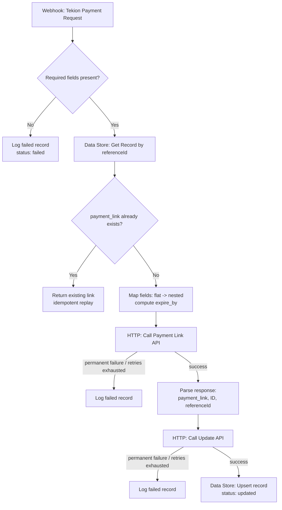

# Payment Link Generation Workflow

Orchestration scenario that receives a payment request from Tekion, generates a payment link via an external Payment Link API, and writes the result back through an Update API — with error handling and idempotency built in.

Built in **Make.com**. See `docs/ASSUMPTIONS.md` for design decisions and documented gotchas, `docs/demo-script.md` for the video walkthrough script, and `make-variant/make-variant-notes.md` for the module-by-module build reference.

**Demo video**: [PASTE GOOGLE DRIVE LINK HERE] (ensure sharing is set to "Anyone with the link" before submitting)

## Architecture



## Scope coverage

| Assignment scope item | How it's met |
|---|---|
| 1. Receive payment request data | Webhook module (contactId, customerName, customerPhone, customerEmail, invoiceNumber, paymentAmount, currency, referenceId, description) |
| 2. Call Payment Link API | HTTP module, POST, with automatic retry-with-backoff on transient failures (Make's Store incomplete executions setting — see ASSUMPTIONS.md) |
| 3. Extract payment_link, ID, referenceId | Parse JSON module on the Payment Link API response |
| 4. Update payment record via Update API | HTTP module, GET-with-body (mirrors spec — see gotcha below), same retry mechanism |
| 5. Error handling for all failure scenarios | Validation fail-fast (no retry) + per-HTTP-call error handlers + idempotency short-circuit, each writing a status record to the Data Store |

## Field mapping (Tekion input → Payment Link API request)

| Tekion field (flat) | Payment Link API field (nested) | Notes |
|---|---|---|
| `customerName` | `customer.name` | required |
| `customerPhone` | `customer.contact` | required |
| `customerEmail` | `customer.email` | optional — omitted if blank, not sent as `null`/`""` |
| `paymentAmount` | `amount` | required |
| `currency` | `currency` | required |
| `referenceId` | `referenceId` | required, also the idempotency key |
| `description` | `description` | passthrough |
| *(not in Tekion payload)* | `expire_by` | computed: now + 24h, Unix seconds |
| *(derived)* | `notify.email` | `true` only if `customerEmail` present |

## Setup & Run

### 1. Import the scenario
1. Make.com → Scenarios → **Create a new scenario** → menu (⋮) → **Import Blueprint** → select `make-variant/blueprint.json`.
2. Create the Data Store it depends on: Data Stores → **Add data store**, name `PaymentRecords`, fields: `referenceId` (text, key), `payment_link` (text), `ID` (text), `status` (text), `errorReason` (text), `timestamp` (date).
3. Enable **Store incomplete executions**: Scenario editor → gear icon → Scenario settings. This is what enables automatic retry-with-backoff on transient HTTP failures (not represented in the blueprint JSON — must be set manually per scenario).
4. Full module-by-module reference: `make-variant/make-variant-notes.md`.

### 2. Get the webhook URL
Open module 1 (Custom Webhook) → copy its URL. This is your trigger endpoint.

### 3. Trigger it
```bash
curl -X POST "<your-webhook-url>" \
  -H "Content-Type: application/json" \
  -d '{
    "contactId": "CONT_10001",
    "customerName": "Amit Sharma",
    "customerPhone": "+919876543210",
    "customerEmail": "amit.sharma@example.com",
    "invoiceNumber": "INV_10234",
    "paymentAmount": 1000,
    "currency": "INR",
    "referenceId": "TS1989",
    "description": "Payment for service order INV_10234"
  }'
```

### Tested results (verified end-to-end, not just expected)

- **Happy path**: confirmed. Scenario ran through to module 16, `PaymentRecords` got a `TS1989` entry with `status: updated`, `payment_link: https://api.xyz.com/v1/payment_links/123456`, `ID: 123456`.
- **Missing field** (dropped `paymentAmount`): confirmed. Route B fired module 4 (`status: failed`, `errorReason: "Missing required field in Tekion payload"`); module 6 (Get a record) correctly did not run — execution log shows "The bundle did not pass through the filter."
- **Idempotency replay** (re-sent the same `TS1989` payload): confirmed. Module 6 found the existing record with `payment_link` already set, routed to module 17 ("Idempotent End"), and none of modules 10/11/13/14/16 executed — no duplicate Payment Link API call.
- **API failure → error handler**: confirmed. An initial run hit a real Payment Link API failure; module 21 (onerror of module 11) correctly logged `status: failed`, `errorReason: "Payment Link API unreachable after 3 retries"`. (Root cause was HTTP module 11 missing "Parse response" — fixed, and the subsequent happy-path run confirmed clean.)

The two API tokens (`122334` for Payment Link API, `12345` for Update API) are already set as static headers in the imported blueprint — no additional credentials needed since these are the assignment's mock endpoints.
